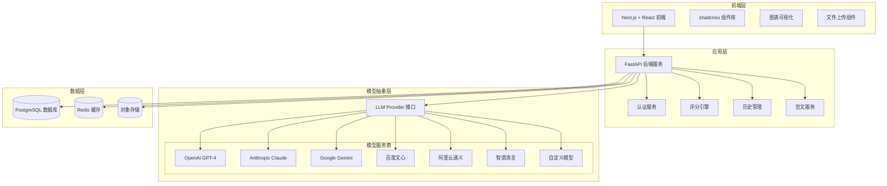
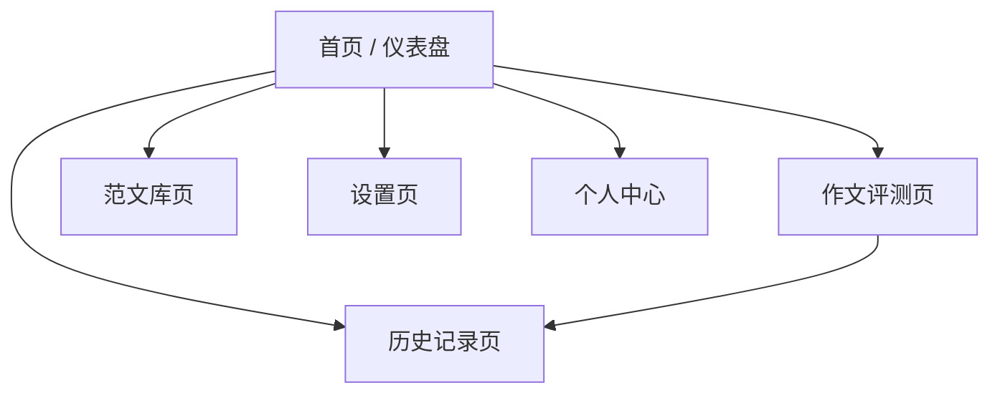
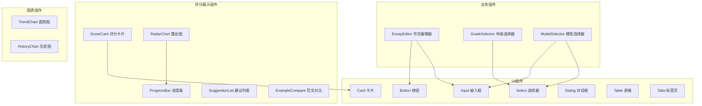
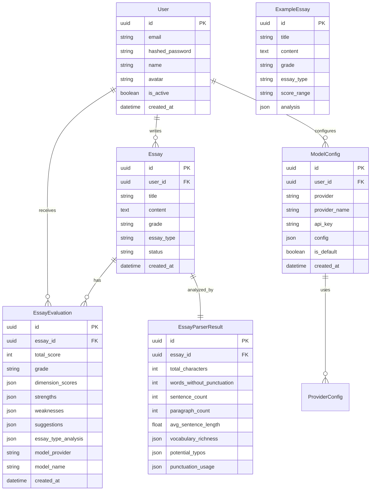
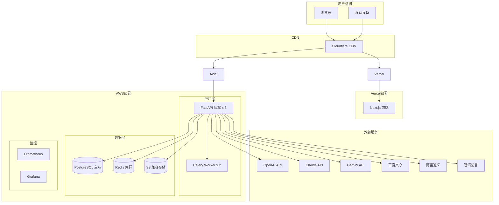

# 青少年写作质量评测系统技术设计

Feature Name: youth-writing-evaluation-system
Updated: 2026-02-06
Version: 2.0

## 1. 系统概述

本系统是一个面向小学阶段青少年的写作质量智能评测平台，采用前后端分离架构。后端基于 FastAPI 构建，提供 LLM 模型无关的评分引擎；前端基于 Next.js + React + shadcn/ui 构建，提供美观易用的用户界面。系统支持多模型服务商接入，用户可灵活配置 OpenAI、Claude、Gemini、百度文心、阿里通义、智谱清言等大语言模型进行作文评分与点评。

## 2. 系统架构

### 2.1 整体架构图



### 2.2 技术栈选型

| 层级 | 技术选型 | 选型理由 |
|------|----------|----------|
| 前端框架 | Next.js 14 + React 18 | App Router 支持、SSR/SSG、丰富生态 |
| UI组件库 | shadcn/ui + Tailwind CSS | 现代化设计、主题定制灵活、代码所有权 |
| 图表库 | Recharts | React 原生、响应式、高度可定制 |
| HTTP客户端 | TanStack Query + Axios | 状态管理、请求缓存、错误重试 |
| 后端框架 | FastAPI + Python 3.11+ | 高性能、自动文档、类型提示完善 |
| ORM | SQLAlchemy 2.0 | 成熟稳定、灵活查询、迁移工具完善 |
| 数据库 | PostgreSQL 15+ | 功能强大、JSON支持、数据完整性 |
| 缓存 | Redis 7.x | 高性能、会话存储、API限流 |
| 对象存储 | MinIO / S3 | 兼容S3协议、图片存储、扩展方便 |
| 任务队列 | Celery + Redis | 异步任务、评分报告生成、OCR处理 |

## 3. 前端设计与实现

### 3.1 页面结构



### 3.2 核心页面设计

#### 3.2.1 首页 / 仪表盘

**页面功能：** 展示用户概览、快速入口、数据统计

**布局结构：**
```
┌─────────────────────────────────────────────────────────┐
│  Logo    导航栏    搜索框    用户头像                    │
├─────────────────────────────────────────────────────────┤
│                                                         │
│  欢迎回来，张小明！                                      │
│  ────────────────────────────                            │
│  📊 本月评测: 12 篇    📈 平均分: 78.5    🏆 最高分: 92 │
│                                                         │
│  ┌─────────────────┐  ┌─────────────────┐                │
│  │  📝 快速评测     │  │  📈 进步曲线   │                │
│  │  立即开始       │  │  查看详情      │                │
│  └─────────────────┘  └─────────────────┘                │
│                                                         │
│  最近评测                                                  │
│  ┌─────────────────────────────────────────────────┐    │
│  │ 《我的妈妈》│ 五年级 │ 85分 │ 优秀 │ 2小时前   │    │
│  │ 《春天》    │ 三年级 │ 72分 │ 良好 │ 昨天     │    │
│  └─────────────────────────────────────────────────┘    │
│                                                         │
│  ┌─────────────────────────────────────────────────┐    │
│  │ 🎯 薄弱维度分析                                   │    │
│  │  结构组织 ████████░░ 65%                         │    │
│  │  书写规范 ██████████ 90%                         │    │
│  └─────────────────────────────────────────────────┘    │
│                                                         │
└─────────────────────────────────────────────────────────┘
```

**字体与排版设计：**
- 主标题：Inter Bold，28px，Primary Color (#1E293B)
- 副标题：Inter Medium，18px，Secondary Color (#64748B)
- 正文：Inter Regular，16px，Text Color (#334155)
- 辅助文字：Inter Regular，14px，Muted Color (#94A3B8)
- 数据卡片数字：Inter Bold，32px，Accent Color (#3B82F6)
- 行间距：1.6倍
- 段间距：24px

**色彩系统（shadcn/ui 主题）：**
```typescript
const theme = {
  primary: {
    DEFAULT: "#3B82F6",
    foreground: "#FFFFFF",
  },
  secondary: {
    DEFAULT: "#F1F5F9",
    foreground: "#1E293B",
  },
  accent: {
    DEFAULT: "#8B5CF6",
    foreground: "#FFFFFF",
  },
  success: {
    DEFAULT: "#10B981",
    foreground: "#FFFFFF",
  },
  warning: {
    DEFAULT: "#F59E0B",
    foreground: "#FFFFFF",
  },
  destructive: {
    DEFAULT: "#EF4444",
    foreground: "#FFFFFF",
  },
  background: "#FAFAFA",
  foreground: "#1E293B",
}
```

#### 3.2.2 作文评测页

**页面功能：** 作文输入、年级选择、模型配置、评测结果展示

**布局结构：**
```
┌─────────────────────────────────────────────────────────┐
│  ← 返回                                                    │
├─────────────────────────────────────────────────────────┤
│                                                         │
│  📝 作文评测                                              │
│                                                         │
│  年级: [五年级 ▼]      写作类型: [自动识别 ▼]             │
│                                                         │
│  ┌─────────────────────────────────────────────────┐    │
│  │  标题（可选）                                     │    │
│  │  [____________________________________________] │    │
│  │                                                 │    │
│  │  作文内容                                         │    │
│  │  [____________________________________________] │    │
│  │  [____________________________________________] │    │
│  │  [____________________________________________] │    │
│  │  [____________________________________________] │    │
│  │                                                 │    │
│  │  📎 支持拖拽上传 .txt .doc .docx .md .zip           │    │
│  └─────────────────────────────────────────────────┘    │
│                                                         │
│  ⚙️ 评分模型选择                                         │
│  ┌─────────────────────────────────────────────────┐    │
│  │  ○ OpenAI GPT-4    ○ 智谱清言    ○ 阿里通义     │    │
│  │  ○ Claude 3       ○ 百度文心    ○ 自定义配置    │    │
│  │  [API Key: ________________________________]    │    │
│  └─────────────────────────────────────────────────┘    │
│                                                         │
│  [           开始评测 (蓝色)            ]                │
│                                                         │
├─────────────────────────────────────────────────────────┤
│  评测结果                                                  │
├─────────────────────────────────────────────────────────┤
│                                                         │
│  ┌─ 总体评分 ──────────────────────────────────────┐   │
│  │                                                     │   │
│  │           85                                         │   │
│  │         优秀                                         │   │
│  │                                                     │   │
│  │  ┌─────────────────────────────────────────────┐  │   │
│  │  │         雷达图（各维度得分）                   │  │   │
│  │  │           内容主题 ████████████ 28/30         │  │   │
│  │  │           结构组织 ██████████ 18/20           │  │   │
│  │  │           语言表达 ███████████ 23/25          │  │   │
│  │  │           书写规范 ████████████ 14/15         │  │   │
│  │  │           创意特色 ██████░░░░░ 6/10          │  │   │
│  │  └─────────────────────────────────────────────┘  │   │
│  │                                                     │   │
│  └─────────────────────────────────────────────────────┘   │
│                                                         │
│  📋 详细评分                                              │
│  ┌─────────────────────────────────────────────────┐    │
│  │ ✅ 内容充实，主题明确，情感真挚                     │    │
│  │ ⚠️  结构略显单一，可增加细节描写                   │    │
│  │ ✅ 语言流畅，用词准确                               │    │
│  │ ✅ 错别字较少，标点使用正确                         │    │
│  │ 💡 开头引人入胜，可继续发挥想象力                   │    │
│  └─────────────────────────────────────────────────┘    │
│                                                         │
│  💡 改进建议                                              │
│  ┌─────────────────────────────────────────────────┐    │
│  │ 1. 丰富人物描写，加入更多细节和动作描写            │    │
│  │ 2. 尝试使用更多修辞手法，如比喻、拟人              │    │
│  │ 3. 结尾可以更有深意，回扣主题                       │    │
│  └─────────────────────────────────────────────────┘    │
│                                                         │
│  📖 范文对比                                              │
│  ┌─────────────────────────────────────────────────┐    │
│  │ 《我的妈妈》- 优秀范文对比                         │    │
│  │ 对比分析 | 原文 | 范文 | 学习建议                 │    │
│  └─────────────────────────────────────────────────┘    │
│                                                         │
└─────────────────────────────────────────────────────────┘
```

### 3.3 核心组件设计



#### 3.3.1 作文编辑器组件 (EssayEditor)

```tsx
// components/essay-editor.tsx
interface EssayEditorProps {
  grade: Grade;
  onGradeChange: (grade: Grade) => void;
  onSubmit: (essay: Essay) => Promise<void>;
}

export function EssayEditor({ grade, onGradeChange, onSubmit }: EssayEditorProps) {
  const [title, setTitle] = useState("");
  const [content, setContent] = useState("");
  const [isLoading, setIsLoading] = useState(false);
  const fileInputRef = useRef<HTMLInputElement>(null);

  return (
    <Card className="w-full max-w-4xl mx-auto">
      <CardHeader>
        <CardTitle className="text-2xl font-bold">📝 作文评测</CardTitle>
      </CardHeader>
      <CardContent className="space-y-6">
        <div className="flex gap-4">
          <div className="w-1/3">
            <Label>年级</Label>
            <GradeSelector value={grade} onChange={onGradeChange} />
          </div>
          <div className="w-2/3">
            <Label>标题（可选）</Label>
            <Input
              placeholder="请输入作文标题"
              value={title}
              onChange={(e) => setTitle(e.target.value)}
            />
          </div>
        </div>

        <div>
          <Label>作文内容</Label>
          <Textarea
            placeholder="请输入或粘贴作文内容..."
            className="min-h-[300px] font-medium text-base leading-relaxed"
            value={content}
            onChange={(e) => setContent(e.target.value)}
          />
        </div>

        <div className="border-2 border-dashed border-gray-200 rounded-lg p-6 text-center">
          <Upload className="mx-auto h-12 w-12 text-gray-400" />
            <p className="mt-2 text-sm text-gray-600">
              支持拖拽上传 .txt .doc .docx .md .zip
            </p>
            <input
              type="file"
              ref={fileInputRef}
              className="hidden"
              accept=".txt,.doc,.docx,.md,.zip"
              multiple={true}
              onChange={handleFileUpload}
            />
          <Button
            variant="outline"
            className="mt-4"
            onClick={() => fileInputRef.current?.click()}
          >
            选择文件
          </Button>
        </div>

        <Button
          className="w-full h-12 text-lg"
          onClick={handleSubmit}
          disabled={isLoading || !content.trim()}
        >
          {isLoading ? (
            <>
              <Loader2 className="mr-2 h-4 w-4 animate-spin" />
              评测中...
            </>
          ) : (
            "开始评测"
          )}
        </Button>
      </CardContent>
    </Card>
  );
}
```

#### 3.3.2 评分展示卡片组件 (ScoreCard)

```tsx
// components/score-card.tsx
interface ScoreCardProps {
  totalScore: number;
  grade: string;
  dimensionScores: DimensionScore[];
  onViewDetails: () => void;
}

export function ScoreCard({ totalScore, grade, dimensionScores, onViewDetails }: ScoreCardProps) {
  const getGradeColor = (score: number) => {
    if (score >= 85) return "text-green-500";
    if (score >= 70) return "text-blue-500";
    if (score >= 60) return "text-yellow-500";
    return "text-red-500";
  };

  const getGradeLabel = (score: number) => {
    if (score >= 85) return "优秀";
    if (score >= 70) return "良好";
    if (score >= 60) return "合格";
    return "待提高";
  };

  return (
    <Card className="bg-gradient-to-br from-blue-50 to-indigo-50">
      <CardContent className="pt-6">
        <div className="flex items-center justify-between">
          <div className="text-center">
            <p className="text-sm text-gray-500">总分</p>
            <p className="text-7xl font-bold text-blue-600">{totalScore}</p>
            <p className={`text-2xl font-medium ${getGradeColor(totalScore)}`}>
              {getGradeLabel(totalScore)}
            </p>
          </div>

          <div className="flex-1 ml-8 space-y-3">
            {dimensionScores.map((dim) => (
              <div key={dim.name} className="space-y-1">
                <div className="flex justify-between text-sm">
                  <span className="font-medium">{dim.name}</span>
                  <span className="text-gray-500">
                    {dim.score}/{dim.maxScore}
                  </span>
                </div>
                <ProgressBar
                  value={dim.score}
                  max={dim.maxScore}
                  color={dim.color}
                />
              </div>
            ))}
          </div>
        </div>

        <Button onClick={onViewDetails} className="w-full mt-6">
          查看详细分析
        </Button>
      </CardContent>
    </Card>
  );
}
```

#### 3.3.3 雷达图组件 (RadarChart)

```tsx
// components/radar-chart.tsx
"use client";

import {
  Radar,
  RadarChart as RechartsRadarChart,
  PolarGrid,
  PolarAngleAxis,
  PolarRadiusAxis,
  ResponsiveContainer,
} from "recharts";

interface RadarChartProps {
  data: {
    subject: string;
    score: number;
    fullMark: number;
  }[];
}

export function RadarChart({ data }: RadarChartProps) {
  return (
    <ResponsiveContainer width="100%" height={300}>
      <RechartsRadarChart data={data}>
        <PolarGrid stroke="#E2E8F0" />
        <PolarAngleAxis
          dataKey="subject"
          tick={{ fill: "#64748B", fontSize: 12 }}
        />
        <PolarRadiusAxis
          angle={30}
          domain={[0, "auto"]}
          tick={{ fill: "#94A3B8", fontSize: 10 }}
        />
        <Radar
          name="得分"
          dataKey="score"
          stroke="#3B82F6"
          fill="#3B82F6"
          fillOpacity={0.5}
        />
      </RechartsRadarChart>
    </ResponsiveContainer>
  );
}
```

### 3.4 shadcn/ui 配置

```tsx
// components.json
{
  "$schema": "https://ui.shadcn.com/schema.json",
  "style": "default",
  "rsc": true,
  "tsx": true,
  "tailwind": {
    "config": "tailwind.config.ts",
    "css": "app/globals.css",
    "baseColor": "slate",
    "cssVariables": true
  },
  "aliases": {
    "components": "@/components",
    "utils": "@/lib/utils"
  }
}
```

```tsx
// tailwind.config.ts
import { fontFamily } from "tailwindcss/defaultTheme";

export const theme = {
  extend: {
    fontFamily: {
      sans: ["Inter", ...fontFamily.sans],
      serif: ["Merriweather", ...fontFamily.serif],
      mono: ["JetBrains Mono", ...fontFamily.mono],
    },
    colors: {
      border: "hsl(var(--border))",
      input: "hsl(var(--input))",
      ring: "hsl(var(--ring))",
      background: "hsl(var(--background))",
      foreground: "hsl(var(--foreground))",
      primary: {
        DEFAULT: "hsl(var(--primary))",
        foreground: "hsl(var(--primary-foreground))",
      },
      secondary: {
        DEFAULT: "hsl(var(--secondary))",
        foreground: "hsl(var(--secondary-foreground))",
      },
      destructive: {
        DEFAULT: "hsl(var(--destructive))",
        foreground: "hsl(var(--destructive-foreground))",
      },
      muted: {
        DEFAULT: "hsl(var(--muted))",
        foreground: "hsl(var(--muted-foreground))",
      },
      accent: {
        DEFAULT: "hsl(var(--accent))",
        foreground: "hsl(var(--accent-foreground))",
      },
      popover: {
        DEFAULT: "hsl(var(--popover))",
        foreground: "hsl(var(--popover-foreground))",
      },
      card: {
        DEFAULT: "hsl(var(--card))",
        foreground: "hsl(var(--card-foreground))",
      },
    },
    borderRadius: {
      lg: "var(--radius)",
      md: "calc(var(--radius) - 2px)",
      sm: "calc(var(--radius) - 4px)",
    },
  },
};
```

## 4. 后端设计与实现

### 4.1 项目结构

```
backend/
├── app/
│   ├── api/
│   │   ├── v1/
│   │   │   ├── __init__.py
│   │   │   ├── endpoints/
│   │   │   │   ├── __init__.py
│   │   │   │   ├── essays.py       # 作文评测接口
│   │   │   │   ├── history.py      # 历史记录接口
│   │   │   │   ├── examples.py     # 范文接口
│   │   │   │   ├── models.py       # 模型配置接口
│   │   │   │   └── users.py       # 用户接口
│   │   │   └── router.py           # 路由配置
│   │   ├── deps.py                # 依赖注入
│   │   └── main.py                # 应用入口
│   │
│   ├── core/
│   │   ├── __init__.py
│   │   ├── config.py              # 配置管理
│   │   ├── security.py            # 安全认证
│   │   └── logging.py             # 日志配置
│   │
│   ├── models/
│   │   ├── __init__.py
│   │   ├── domain/
│   │   │   ├── __init__.py
│   │   │   ├── user.py            # 用户模型
│   │   │   ├── essay.py           # 作文模型
│   │   │   ├── evaluation.py      # 评测模型
│   │   │   ├── example.py         # 范文模型
│   │   │   └── model_config.py    # 模型配置模型
│   │   └── database.py            # 数据库模型
│   │
│   ├── schemas/
│   │   ├── __init__.py
│   │   ├── essay.py               # Pydantic schemas
│   │   ├── evaluation.py
│   │   ├── user.py
│   │   └── model_config.py
│   │
│   ├── services/
│   │   ├── __init__.py
│   │   ├── llm/
│   │   │   ├── __init__.py
│   │   │   ├── base.py            # LLM Provider 抽象基类
│   │   │   ├── openai.py          # OpenAI 实现
│   │   │   ├── anthropic.py       # Claude 实现
│   │   │   ├── google.py          # Gemini 实现
│   │   │   ├── baidu.py           # 百度文心实现
│   │   │   ├── aliyun.py          # 阿里通义实现
│   │   │   ├── zhipu.py           # 智谱清言实现
│   │   │   └── factory.py         # 模型工厂
│   │   ├── scoring/
│   │   │   ├── __init__.py
│   │   │   ├── engine.py          # 评分引擎
│   │   │   ├── parser.py          # 作文解析器
│   │   │   └── formatter.py       # 结果格式化
│   │   ├── essay/
│   │   │   ├── __init__.py
│   │   │   ├── service.py         # 作文服务
│   │   │   └── classifier.py      # 作文分类器
│   │   ├── history/
│   │   │   └── service.py         # 历史记录服务
│   │   └── example/
│   │       └── service.py         # 范文服务
│   │
│   └── utils/
│       ├── __init__.py
│       ├── text.py                 # 文本处理工具
│       └── file.py                 # 文件处理工具
│
├── migrations/
├── tests/
├── requirements.txt
└── Dockerfile
```

### 4.2 LLM Provider 抽象设计

```python
# app/services/llm/base.py
from abc import ABC, abstractmethod
from typing import Any, Dict, List, Optional
from pydantic import BaseModel


class LLMResponse(BaseModel):
    """LLM 响应模型"""
    content: str
    usage: Optional[Dict[str, int]] = None
    model: str
    finish_reason: Optional[str] = None
    raw_response: Optional[Any] = None


class LLMProvider(ABC):
    """LLM 服务商抽象基类"""

    @property
    @abstractmethod
    def provider_name(self) -> str:
        """服务商名称"""
        pass

    @property
    @abstractmethod
    def supported_models(self) -> List[str]:
        """支持的模型列表"""
        pass

    @abstractmethod
    async def generate(
        self,
        prompt: str,
        model: Optional[str] = None,
        temperature: float = 0.3,
        max_tokens: Optional[int] = None,
        **kwargs
    ) -> LLMResponse:
        """生成内容"""
        pass

    @abstractmethod
    def validate_api_key(self, api_key: str) -> bool:
        """验证 API Key 是否有效"""
        pass

    @abstractmethod
    def to_config_dict(self, api_key: str) -> Dict[str, Any]:
        """转换为配置字典"""
        pass


class EssayScoringTemplate:
    """作文评分提示词模板"""

    SYSTEM_PROMPT = """你是一位经验丰富的小学语文教师，专门负责评价小学生的作文。你的评价应当：

1. **温和鼓励**：始终以鼓励为主，避免打击学生积极性
2. **具体明确**：指出具体优点和需要改进的地方
3. **适龄评价**：根据学生的年级调整评价标准
4. **建设性建议**：提供切实可行的改进建议

请按照我提供的评分维度对作文进行评价。
"""

    SCORING_DIMENSIONS = {
        "content_theme": {
            "name": "内容主题",
            "description": "评估主题是否明确、内容是否充实、思想是否有深度",
            "weight": {"一年级": 0.25, "二年级": 0.25, "三年级": 0.25, "四年级": 0.28, "五年级": 0.30, "六年级": 0.30}
        },
        "structure": {
            "name": "结构组织",
            "description": "评估段落是否清晰、逻辑是否连贯、开头结尾是否精彩",
            "weight": {"一年级": 0.15, "二年级": 0.15, "三年级": 0.20, "四年级": 0.22, "五年级": 0.22, "六年级": 0.25}
        },
        "language": {
            "name": "语言表达",
            "description": "评估用词是否准确、句式是否丰富、表达是否流畅",
            "weight": {"一年级": 0.30, "二年级": 0.30, "三年级": 0.25, "四年级": 0.25, "五年级": 0.23, "六年级": 0.22}
        },
        "writing_norm": {
            "name": "书写规范",
            "description": "评估错别字数量、标点使用、格式规范",
            "weight": {"一年级": 0.25, "二年级": 0.25, "三年级": 0.20, "四年级": 0.15, "五年级": 0.15, "六年级": 0.13}
        },
        "creativity": {
            "name": "创意特色",
            "description": "评估是否有独特视角、创新表达、个人风格",
            "weight": {"一年级": 0.05, "二年级": 0.05, "三年级": 0.10, "四年级": 0.10, "五年级": 0.10, "六年级": 0.10}
        }
    }

    @classmethod
    def build_scoring_prompt(
        cls,
        essay_content: str,
        essay_title: Optional[str],
        grade: str,
        essay_type: str
    ) -> str:
        """构建评分提示词"""
        dimension_weights = cls.SCORING_DIMENSIONS
        weight = {
            dim: info["weight"][grade]
            for dim, info in dimension_weights.items()
        }

        prompt = f"""{cls.SYSTEM_PROMPT}

## 作文信息
- 年级：{grade}
- 写作类型：{essay_type}
- 标题：{essay_title or '无'}
- 正文：
---
{essay_content}
---

## 评分维度与权重
请对以下五个维度进行评分（总分100分）：

### 1. 内容主题（满分30分，权重{weight['content_theme']*100:.0f}%）
评估要点：
- 主题是否明确、突出
- 内容是否充实、具体
- 思想是否有深度、感悟是否真挚
得分范围：0-30分

### 2. 结构组织（满分20分，权重{weight['structure']*100:.0f}%）
评估要点：
- 段落划分是否清晰
- 逻辑是否连贯、条理清楚
- 开头是否吸引人、结尾是否精彩
得分范围：0-20分

### 3. 语言表达（满分25分，权重{weight['language']*100:.0f}%）
评估要点：
- 用词是否准确、生动
- 句式是否丰富多变
- 表达是否流畅、通顺
得分范围：0-25分

### 4. 书写规范（满分15分，权重{weight['writing_norm']*100:.0f}%）
评估要点：
- 错别字数量（每2个错别字扣1分，上限扣5分）
- 标点使用是否正确
- 格式是否规范
得分范围：0-15分

### 5. 创意特色（满分10分，权重{weight['creativity']*100:.0f}%）
评估要点：
- 是否有独特的观察视角
- 是否有创新的表达方式
- 是否展现出个人风格
得分范围：0-10分

## 输出格式
请严格按照以下 JSON 格式输出评分结果：

```json
{{
    "total_score": 85,
    "grade": "优秀",
    "dimensions": {{
        "content_theme": {{
            "score": 28,
            "max_score": 30,
            "comment": "内容充实，主题明确..."
        }},
        "structure": {{
            "score": 18,
            "max_score": 20,
            "comment": "结构清晰..."
        }},
        "language": {{
            "score": 22,
            "max_score": 25,
            "comment": "语言流畅..."
        }},
        "writing_norm": {{
            "score": 12,
            "max_score": 15,
            "comment": "错别字较少..."
        }},
        "creativity": {{
            "score": 5,
            "max_score": 10,
            "comment": "有一定创意..."
        }}
    }},
    "strengths": [
        "主题明确，情感真挚",
        "语言流畅，用词准确"
    ],
    "weaknesses": [
        "结构略显单一"
    ],
    "suggestions": [
        "建议增加更多细节描写",
        "可以尝试使用比喻、拟人等修辞手法"
    ],
    "essay_type_analysis": {{
        "identified_type": "记叙文",
        "type_match_score": 0.9,
        "type_specific_comments": "六要素基本完整，事件描写较为生动"
    }}
}}
```
"""
        return prompt
```

### 4.3 OpenAI Provider 实现

```python
# app/services/llm/openai.py
from typing import Any, Dict, List, Optional
from openai import AsyncOpenAI
from openai.types import Completion
from pydantic import BaseModel

from app.services.llm.base import LLMProvider, LLMResponse


class OpenAIProvider(LLMProvider):
    """OpenAI 服务商实现"""

    def __init__(self, api_key: Optional[str] = None):
        self.api_key = api_key
        self._client: Optional[AsyncOpenAI] = None

    @property
    def provider_name(self) -> str:
        return "OpenAI"

    @property
    def supported_models(self) -> List[str]:
        return ["gpt-4", "gpt-4-turbo", "gpt-3.5-turbo"]

    @property
    def client(self) -> AsyncOpenAI:
        if self._client is None:
            self._client = AsyncOpenAI(api_key=self.api_key)
        return self._client

    async def generate(
        self,
        prompt: str,
        model: str = "gpt-4-turbo",
        temperature: float = 0.3,
        max_tokens: Optional[int] = None,
        **kwargs
    ) -> LLMResponse:
        response = await self.client.chat.completions.create(
            model=model,
            messages=[
                {"role": "system", "content": "你是一位专业的小学语文教师。"},
                {"role": "user", "content": prompt}
            ],
            temperature=temperature,
            max_tokens=max_tokens,
            response_format={"type": "json_object"}
        )

        return LLMResponse(
            content=response.choices[0].message.content or "",
            usage={
                "prompt_tokens": response.usage.prompt_tokens,
                "completion_tokens": response.usage.completion_tokens,
                "total_tokens": response.usage.total_tokens
            },
            model=model,
            finish_reason=response.choices[0].finish_reason,
            raw_response=response
        )

    def validate_api_key(self, api_key: str) -> bool:
        try:
            client = AsyncOpenAI(api_key=api_key)
            # 简单验证：尝试调用一个轻量级请求
            import asyncio
            # 实际验证代码...
            return True
        except Exception:
            return False

    def to_config_dict(self, api_key: str) -> Dict[str, Any]:
        return {
            "provider": "openai",
            "api_key": api_key,
            "models": self.supported_models
        }
```

### 4.4 Claude Provider 实现

```python
# app/services/llm/anthropic.py
from typing import Any, Dict, List, Optional
import anthropic
from anthropic import Anthropic

from app.services.llm.base import LLMProvider, LLMResponse


class AnthropicProvider(LLMProvider):
    """Anthropic Claude 服务商实现"""

    def __init__(self, api_key: Optional[str] = None):
        self.api_key = api_key
        self._client: Optional[Anthropic] = None

    @property
    def provider_name(self) -> str:
        return "Anthropic Claude"

    @property
    def supported_models(self) -> List[str]:
        return ["claude-3-5-sonnet-20241022", "claude-3-haiku-20240307"]

    @property
    def client(self) -> Anthropic:
        if self._client is None:
            self._client = Anthropic(api_key=self.api_key)
        return self._client

    async def generate(
        self,
        prompt: str,
        model: str = "claude-3-5-sonnet-20241022",
        temperature: float = 0.3,
        max_tokens: Optional[int] = None,
        **kwargs
    ) -> LLMResponse:
        response = self.client.messages.create(
            model=model,
            max_tokens=max_tokens or 4096,
            temperature=temperature,
            system="你是一位专业的小学语文教师，擅长评价和指导小学生写作文。",
            messages=[
                {"role": "user", "content": prompt}
            ]
        )

        return LLMResponse(
            content=response.content[0].text,
            usage={
                "input_tokens": response.usage.input_tokens,
                "output_tokens": response.usage.output_tokens
            },
            model=model,
            finish_reason=str(response.stop_reason),
            raw_response=response
        )

    def validate_api_key(self, api_key: str) -> bool:
        try:
            client = Anthropic(api_key=api_key)
            return True
        except Exception:
            return False

    def to_config_dict(self, api_key: str) -> Dict[str, Any]:
        return {
            "provider": "anthropic",
            "api_key": api_key,
            "models": self.supported_models
        }
```

### 4.5 Google Gemini Provider 实现

```python
# app/services/llm/google.py
from typing import Any, Dict, List, Optional
import google.generativeai as genai

from app.services.llm.base import LLMProvider, LLMResponse


class GoogleProvider(LLMProvider):
    """Google Gemini 服务商实现"""

    def __init__(self, api_key: Optional[str] = None):
        self.api_key = api_key
        genai.configure(api_key=api_key)

    @property
    def provider_name(self) -> str:
        return "Google Gemini"

    @property
    def supported_models(self) -> List[str]:
        return ["gemini-1.5-pro", "gemini-1.5-flash", "gemini-1.0-pro"]

    async def generate(
        self,
        prompt: str,
        model: str = "gemini-1.5-pro",
        temperature: float = 0.3,
        max_tokens: Optional[int] = None,
        **kwargs
    ) -> LLMResponse:
        generation_config = {
            "temperature": temperature,
            "max_output_tokens": max_tokens or 2048,
        }

        model_instance = genai.GenerativeModel(
            model_name=model,
            generation_config=generation_config,
            system_instruction="你是一位专业的小学语文教师，擅长评价和指导小学生写作文。"
        )

        response = model_instance.generate_content(prompt)

        return LLMResponse(
            content=response.text,
            model=model,
            raw_response=response
        )

    def validate_api_key(self, api_key: str) -> bool:
        try:
            genai.configure(api_key=api_key)
            models = genai.list_models()
            return len(list(models)) > 0
        except Exception:
            return False

    def to_config_dict(self, api_key: str) -> Dict[str, Any]:
        return {
            "provider": "google",
            "api_key": api_key,
            "models": self.supported_models
        }
```

### 4.6 国内模型服务商实现

#### 4.6.1 百度文心

```python
# app/services/llm/baidu.py
from typing import Any, Dict, List, Optional
import requests

from app.services.llm.base import LLMProvider, LLMResponse


class BaiduProvider(LLMProvider):
    """百度文心一言服务商实现"""

    def __init__(self, api_key: Optional[str] = None, secret_key: Optional[str] = None):
        self.api_key = api_key
        self.secret_key = secret_key
        self._access_token: Optional[str] = None

    @property
    def provider_name(self) -> str:
        return "百度文心一言"

    @property
    def supported_models(self) -> List[str]:
        return ["ernie-4.0-8k", "ernie-3.5-8k", "ernie-speed-8k"]

    def _get_access_token(self) -> str:
        """获取百度访问令牌"""
        if self._access_token:
            return self._access_token

        url = "https://aip.baidubce.com/oauth/2.0/token"
        params = {
            "grant_type": "client_credentials",
            "client_id": self.api_key,
            "client_secret": self.secret_key
        }
        response = requests.post(url, params=params)
        self._access_token = response.json().get("access_token")
        return self._access_token

    async def generate(
        self,
        prompt: str,
        model: str = "ernie-3.5-8k",
        temperature: float = 0.3,
        max_tokens: Optional[int] = None,
        **kwargs
    ) -> LLMResponse:
        access_token = self._get_access_token()
        url = f"https://aip.baidubce.com/rpc/2.0/ai_custom/v1/wenxinworkshop/chat/{model}"

        headers = {"Content-Type": "application/json"}
        payload = {
            "messages": [
                {"role": "system", "content": "你是一位专业的小学语文教师。"},
                {"role": "user", "content": prompt}
            ],
            "temperature": temperature,
            "max_output_tokens": max_tokens or 2048
        }

        response = requests.post(url, params={"access_token": access_token}, json=payload, headers=headers)

        return LLMResponse(
            content=response.json().get("result", ""),
            model=model,
            raw_response=response.json()
        )

    def validate_api_key(self, api_key: str) -> bool:
        # 百度需要 api_key 和 secret_key 配对验证
        return bool(api_key and self.secret_key)

    def to_config_dict(self, api_key: str) -> Dict[str, Any]:
        return {
            "provider": "baidu",
            "api_key": api_key,
            "secret_key": self.secret_key,
            "models": self.supported_models
        }
```

#### 4.6.2 阿里通义

```python
# app/services/llm/aliyun.py
from typing import Any, Dict, List, Optional
import httpx

from app.services.llm.base import LLMProvider, LLMResponse


class AliyunProvider(LLMProvider):
    """阿里云通义千问服务商实现"""

    def __init__(self, api_key: Optional[str] = None):
        self.api_key = api_key

    @property
    def provider_name(self) -> str:
        return "阿里云通义千问"

    @property
    def supported_models(self) -> List[str]:
        return ["qwen-turbo", "qwen-plus", "qwen-max"]

    async def generate(
        self,
        prompt: str,
        model: str = "qwen-plus",
        temperature: float = 0.3,
        max_tokens: Optional[int] = None,
        **kwargs
    ) -> LLMResponse:
        url = f"https://dashscope.aliyuncs.com/api/v1/services/aigc/text-generation/generation/{model}"

        headers = {
            "Authorization": f"Bearer {self.api_key}",
            "Content-Type": "application/json"
        }
        payload = {
            "input": {
                "messages": [
                    {"role": "system", "content": "你是一位专业的小学语文教师。"},
                    {"role": "user", "content": prompt}
                ]
            },
            "parameters": {
                "temperature": temperature,
                "max_tokens": max_tokens or 2048
            }
        }

        async with httpx.AsyncClient() as client:
            response = await client.post(url, json=payload, headers=headers)

        return LLMResponse(
            content=response.json().get("output", {}).get("text", ""),
            model=model,
            raw_response=response.json()
        )

    def validate_api_key(self, api_key: str) -> bool:
        return bool(api_key)

    def to_config_dict(self, api_key: str) -> Dict[str, Any]:
        return {
            "provider": "aliyun",
            "api_key": api_key,
            "models": self.supported_models
        }
```

#### 4.6.3 智谱清言

```python
# app/services/llm/zhipu.py
from typing import Any, Dict, List, Optional
import httpx

from app.services.llm.base import LLMProvider, LLMResponse


class ZhiPuProvider(LLMProvider):
    """智谱清言服务商实现"""

    def __init__(self, api_key: Optional[str] = None):
        self.api_key = api_key

    @property
    def provider_name(self) -> str:
        return "智谱清言"

    @property
    def supported_models(self) -> List[str]:
        return ["glm-4", "glm-4-plus", "glm-4v", "glm-3-turbo"]

    async def generate(
        self,
        prompt: str,
        model: str = "glm-4",
        temperature: float = 0.3,
        max_tokens: Optional[int] = None,
        **kwargs
    ) -> LLMResponse:
        url = "https://open.bigmodel.cn/api/paas/v4/chat/completions"

        headers = {
            "Authorization": f"Bearer {self.api_key}",
            "Content-Type": "application/json"
        }
        payload = {
            "model": model,
            "messages": [
                {"role": "system", "content": "你是一位专业的小学语文教师。"},
                {"role": "user", "content": prompt}
            ],
            "temperature": temperature,
            "max_tokens": max_tokens or 2048
        }

        async with httpx.AsyncClient() as client:
            response = await client.post(url, json=payload, headers=headers)

        return LLMResponse(
            content=response.json().get("choices", [{}])[0].get("message", {}).get("content", ""),
            model=model,
            raw_response=response.json()
        )

    def validate_api_key(self, api_key: str) -> bool:
        return bool(api_key)

    def to_config_dict(self, api_key: str) -> Dict[str, Any]:
        return {
            "provider": "zhipu",
            "api_key": api_key,
            "models": self.supported_models
        }
```

### 4.7 模型工厂与自定义模型

```python
# app/services/llm/factory.py
from typing import Any, Dict, List, Optional, Type
from app.services.llm.base import LLMProvider
from app.services.llm.openai import OpenAIProvider
from app.services.llm.anthropic import AnthropicProvider
from app.services.llm.google import GoogleProvider
from app.services.llm.baidu import BaiduProvider
from app.services.llm.aliyun import AliyunProvider
from app.services.llm.zhipu import ZhiPuProvider


class LLMFactory:
    """LLM 服务商工厂"""

    _providers: Dict[str, Type[LLMProvider]] = {
        "openai": OpenAIProvider,
        "anthropic": AnthropicProvider,
        "google": GoogleProvider,
        "baidu": BaiduProvider,
        "aliyun": AliyunProvider,
        "zhipu": ZhiPuProvider,
    }

    @classmethod
    def register_provider(cls, name: str, provider_class: Type[LLMProvider]) -> None:
        """注册自定义模型服务商"""
        cls._providers[name] = provider_class

    @classmethod
    def get_provider(
        cls,
        provider_name: str,
        api_key: Optional[str] = None,
        **kwargs
    ) -> LLMProvider:
        """获取指定服务商实例"""
        provider_class = cls._providers.get(provider_name.lower())
        if not provider_class:
            raise ValueError(f"Unknown provider: {provider_name}")
        return provider_class(api_key=api_key, **kwargs)

    @classmethod
    def list_providers(cls) -> List[str]:
        """列出所有可用服务商"""
        return list(cls._providers.keys())

    @classmethod
    def get_provider_info(cls, provider_name: str) -> Dict[str, Any]:
        """获取服务商信息"""
        provider_class = cls._providers.get(provider_name.lower())
        if not provider_class:
            return {}
        provider = provider_class()
        return {
            "name": provider.provider_name,
            "models": provider.supported_models
        }


# 自定义模型服务商示例
class CustomOpenAICompatibleProvider(LLMProvider):
    """自定义 OpenAI 兼容 API 服务商"""

    def __init__(
        self,
        api_key: str,
        base_url: str,
        provider_name: str = "自定义模型",
        supported_models: List[str] = None
    ):
        self.api_key = api_key
        self.base_url = base_url
        self._provider_name = provider_name
        self._supported_models = supported_models or ["custom-model"]
        self._client = None

    @property
    def provider_name(self) -> str:
        return self._provider_name

    @property
    def supported_models(self) -> List[str]:
        return self._supported_models

    async def generate(
        self,
        prompt: str,
        model: str = "custom-model",
        temperature: float = 0.3,
        max_tokens: Optional[int] = None,
        **kwargs
    ) -> LLMResponse:
        # 实现 OpenAI 兼容的 API 调用
        import httpx

        async with httpx.AsyncClient() as client:
            response = await client.post(
                f"{self.base_url}/chat/completions",
                headers={"Authorization": f"Bearer {self.api_key}"},
                json={
                    "model": model,
                    "messages": [
                        {"role": "system", "content": "你是一位专业的小学语文教师。"},
                        {"role": "user", "content": prompt}
                    ],
                    "temperature": temperature,
                    "max_tokens": max_tokens
                }
            )

        return LLMResponse(
            content=response.json().get("choices", [{}])[0].get("message", {}).get("content", ""),
            model=model,
            raw_response=response.json()
        )

    def validate_api_key(self, api_key: str) -> bool:
        return bool(api_key and self.base_url)

    def to_config_dict(self, api_key: str) -> Dict[str, Any]:
        return {
            "provider": "custom",
            "api_key": api_key,
            "base_url": self.base_url,
            "name": self._provider_name,
            "models": self._supported_models
        }


def register_custom_provider(
    name: str,
    provider_name: str,
    base_url: str,
    supported_models: List[str]
) -> None:
    """便捷的自定义模型注册函数"""
    class CustomProvider(CustomOpenAICompatibleProvider):
        pass

    CustomProvider.__name__ = f"Custom{name.title()}Provider"
    LLMFactory.register_provider(name, CustomProvider)
```

### 4.8 评分引擎

```python
# app/services/scoring/engine.py
import json
import re
from typing import Any, Dict, List, Optional, Tuple
from pydantic import BaseModel

from app.services.llm.base import LLMProvider, EssayScoringTemplate
from app.services.essay.classifier import EssayClassifier


class DimensionScore(BaseModel):
    """维度得分"""
    name: str
    score: float
    max_score: float
    comment: str


class ScoringResult(BaseModel):
    """评分结果"""
    total_score: int
    grade: str
    dimensions: Dict[str, DimensionScore]
    strengths: List[str]
    weaknesses: List[str]
    suggestions: List[str]
    essay_type_analysis: Dict[str, Any]


class EssayScoringEngine:
    """作文评分引擎"""

    def __init__(self, llm_provider: LLMProvider):
        self.llm_provider = llm_provider
        self.essay_classifier = EssayClassifier()

    async def score_essay(
        self,
        essay_content: str,
        essay_title: Optional[str],
        grade: str,
        essay_type: Optional[str] = None
    ) -> ScoringResult:
        # 1. 自动识别写作类型（如果未指定）
        if not essay_type:
            identified_type = await self.essay_classifier.classify(essay_content)
        else:
            identified_type = essay_type

        # 2. 构建评分提示词
        prompt = EssayScoringTemplate.build_scoring_prompt(
            essay_content=essay_content,
            essay_title=essay_title,
            grade=grade,
            essay_type=identified_type
        )

        # 3. 调用 LLM 评分
        response = await self.llm_provider.generate(
            prompt=prompt,
            model="gpt-4-turbo",  # 可配置
            temperature=0.3,
            max_tokens=4096
        )

        # 4. 解析结果
        result = self._parse_response(response.content)

        # 5. 验证总分
        total = sum(dim.score for dim in result.dimensions.values())
        if abs(total - result.total_score) > 2:
            result.total_score = int(total)

        return result

    def _parse_response(self, content: str) -> ScoringResult:
        """解析 LLM 返回的 JSON 结果"""
        # 提取 JSON
        json_match = re.search(r'```json\s*([\s\S]*?)\s*```', content)
        if json_match:
            json_str = json_match.group(1)
        else:
            # 尝试直接解析
            json_str = content

        data = json.loads(json_str)

        # 构建维度得分
        dimensions = {}
        for key, dim_data in data.get("dimensions", {}).items():
            dimensions[key] = DimensionScore(
                name=dim_data.get("name", key),
                score=dim_data.get("score", 0),
                max_score=dim_data.get("max_score", 0),
                comment=dim_data.get("comment", "")
            )

        return ScoringResult(
            total_score=data.get("total_score", 0),
            grade=data.get("grade", "合格"),
            dimensions=dimensions,
            strengths=data.get("strengths", []),
            weaknesses=data.get("weaknesses", []),
            suggestions=data.get("suggestions", []),
            essay_type_analysis=data.get("essay_type_analysis", {})
        )

    def calculate_grade(self, total_score: int) -> str:
        """计算评级"""
        if total_score >= 85:
            return "优秀"
        elif total_score >= 70:
            return "良好"
        elif total_score >= 60:
            return "合格"
        else:
            return "待提高"
```

### 4.9 作文解析器

```python
# app/services/scoring/parser.py
import re
from typing import Any, Dict, List, Tuple
from collections import Counter


class EssayParser:
    """作文解析器"""

    # 常用字词库（简化版示例）
    COMMON_WORDS = set([
        "的", "了", "是", "我", "你", "他", "她", "它", "们", "这", "那",
        "有", "在", "来", "去", "看", "说", "叫", "想", "做", "到",
        # ... 更多常用字
    ])

    # 常见错别字对照
    TYPO_CORRECTIONS = {
        "已经": "已经",
        "以经": "已经",
        "在再": "在",
        "再在": "再",
        "象像": "像",
        "像象": "像",
        "己已": "已",
        "已己": "己",
        "折/真": "真",
        "假/甲": "假",
    }

    def __init__(self):
        self.chinese_char_pattern = re.compile(r'[\u4e00-\u9fa5]')

    def parse(self, content: str) -> Dict[str, Any]:
        """解析作文内容"""
        return {
            "total_characters": self._count_characters(content),
            "words_without_punctuation": self._count_words(content),
            "sentence_count": self._count_sentences(content),
            "paragraph_count": self._count_paragraphs(content),
            "average_sentence_length": self._calc_avg_sentence_length(content),
            "vocabulary_richness": self._calc_vocabulary_richness(content),
            "potential_typos": self._find_potential_typos(content),
            "punctuation_usage": self._analyze_punctuation(content),
        }

    def _count_characters(self, content: str) -> int:
        """统计中文字符数"""
        return len(self.chinese_char_pattern.findall(content))

    def _count_words(self, content: str) -> int:
        """统计去标点后的字数"""
        cleaned = re.sub(r'[^\w\s]', '', content)
        return len(cleaned)

    def _count_sentences(self, content: str) -> int:
        """统计句子数量"""
        sentences = re.split(r'[。！？]', content)
        return len([s for s in sentences if s.strip()])

    def _count_paragraphs(self, content: str) -> int:
        """统计段落数量"""
        paragraphs = [p for p in content.split('\n\n') if p.strip()]
        return max(len(paragraphs), 1)

    def _calc_avg_sentence_length(self, content: str) -> float:
        """计算平均句长"""
        char_count = self._count_characters(content)
        sentence_count = self._count_sentences(content)
        if sentence_count == 0:
            return 0
        return round(char_count / sentence_count, 2)

    def _calc_vocabulary_richness(self, content: str) -> Dict[str, Any]:
        """计算词汇丰富度"""
        words = re.findall(r'[\u4e00-\u9fa5]{2,}', content)
        if not words:
            return {"unique_count": 0, "total_count": 0, "richness": 0}
        
        unique_words = set(words)
        richness = len(unique_words) / len(words) if words else 0
        
        return {
            "unique_count": len(unique_words),
            "total_count": len(words),
            "richness": round(richness, 3)
        }

    def _find_potential_typos(self, content: str) -> List[Dict[str, Any]]:
        """查找可能的错别字"""
        potential_typos = []
        for wrong, correct in self.TYPO_CORRECTIONS.items():
            if wrong in content:
                count = content.count(wrong)
                potential_typos.append({
                    "wrong": wrong,
                    "correct": correct,
                    "count": count,
                    "suggestion": f"'{wrong}' 应为 '{correct}'"
                })
        return potential_typos

    def _analyze_punctuation(self, content: str) -> Dict[str, Any]:
        """分析标点使用"""
        punctuation_counts = Counter(content)
        total = len(content)
        
        return {
            "comma_count": punctuation_counts.get('，', 0),
            "period_count": punctuation_counts.get('。', 0),
            "question_mark_count": punctuation_counts.get('？', 0),
            "exclamation_count": punctuation_counts.get('！', 0),
            "colon_count": punctuation_counts.get('：', 0),
            "semicolon_count": punctuation_counts.get('；', 0),
            "quotation_count": punctuation_counts.get('"', 0) + punctuation_counts.get('"', 0),
        }

    def roundtrip_validation(self, original: str, parsed_data: Dict[str, Any]) -> bool:
        """往返验证：确保解析结果可重现"""
        # 验证字数统计
        recalculated_chars = self._count_characters(original)
        if recalculated_chars != parsed_data["total_characters"]:
            return False

        # 验证句子数
        recalculated_sentences = self._count_sentences(original)
        if recalculated_sentences != parsed_data["sentence_count"]:
            return False

        return True
```

## 10. 批量处理与存储设计

### 10.1 文件上传处理

```python
# app/services/file/processor.py
import os
import zipfile
import hashlib
from pathlib import Path
from typing import List, Optional, Tuple
from dataclasses import dataclass
from enum import Enum

from pydantic import BaseModel


class FileType(Enum):
    DOC = ".doc"
    DOCX = ".docx"
    MD = ".md"
    TXT = ".txt"
    ZIP = ".zip"


@dataclass
class ProcessedFile:
    """处理后的文件"""
    original_name: str
    file_type: FileType
    content: str
    file_size: int
    checksum: str
    temp_path: Optional[str] = None


class FileProcessor:
    """文件处理器"""

    # 支持的文件类型
    SUPPORTED_TYPES = {".doc", ".docx", ".md", ".txt", ".zip"}

    # 最大文件大小 (10MB)
    MAX_FILE_SIZE = 10 * 1024 * 1024

    # ZIP解压限制
    MAX_ZIP_FILES = 100
    MAX_ZIP_DEPTH = 3
    MAX_UNZIP_SIZE = 500 * 1024 * 1024  # 500MB

    def __init__(self, temp_dir: str = "/tmp/essay_processor"):
        self.temp_dir = Path(temp_dir)
        self.temp_dir.mkdir(parents=True, exist_ok=True)

    async def process_upload(
        self,
        file_content: bytes,
        filename: str
    ) -> ProcessedFile:
        """处理上传的文件"""
        # 1. 验证文件类型
        file_ext = Path(filename).suffix.lower()
        if file_ext not in self.SUPPORTED_TYPES:
            raise ValueError(f"不支持的文件格式: {file_ext}")

        # 2. 验证文件大小
        if len(file_content) > self.MAX_FILE_SIZE:
            raise ValueError(f"文件大小超过限制: {len(file_content)} > {self.MAX_FILE_SIZE}")

        # 3. 计算校验和
        checksum = hashlib.md5(file_content).hexdigest()

        # 4. 根据类型处理
        if file_ext == ".zip":
            return await self._process_zip(file_content, filename, checksum)
        else:
            return self._process_document(file_content, filename, file_ext, checksum)

    def _process_document(
        self,
        content: bytes,
        filename: str,
        file_ext: str,
        checksum: str
    ) -> ProcessedFile:
        """处理普通文档"""
        if file_ext == ".docx":
            text = self._parse_docx(content)
        elif file_ext == ".md":
            text = content.decode("utf-8")
        elif file_ext == ".txt":
            text = content.decode("utf-8")
        else:
            text = content.decode("utf-8", errors="ignore")

        return ProcessedFile(
            original_name=filename,
            file_type=self._ext_to_filetype(file_ext),
            content=text,
            file_size=len(content),
            checksum=checksum
        )

    async def _process_zip(
        self,
        content: bytes,
        filename: str,
        checksum: str
    ) -> ProcessedFile:
        """处理ZIP压缩包"""
        temp_zip_path = self.temp_dir / f"zip_{checksum}.zip"

        try:
            # 写入临时ZIP文件
            with open(temp_zip_path, "wb") as f:
                f.write(content)

            # 解压验证
            with zipfile.ZipFile(temp_zip_path, "r") as zf:
                # 验证文件数量
                if len(zf.namelist()) > self.MAX_ZIP_FILES:
                    raise ValueError(f"ZIP文件包含过多文件: {len(zf.namelist())}")

                # 验证解压大小
                total_size = sum(info.file_size for info in zf.infolist())
                if total_size > self.MAX_UNZIP_SIZE:
                    raise ValueError(f"解压后总大小超过限制: {total_size}")

                # 解压到临时目录
                extract_dir = self.temp_dir / f"extract_{checksum}"
                extract_dir.mkdir(exist_ok=True)
                zf.extractall(extract_dir)

                # 处理所有文件
                all_content = []
                success_count = 0
                fail_count = 0
                fail_files = []

                for file_path in self._iterate_files(extract_dir):
                    try:
                        file_content = self._process_single_file(file_path)
                        all_content.append(file_content)
                        success_count += 1
                    except Exception as e:
                        fail_count += 1
                        fail_files.append((str(file_path), str(e)))

                # 生成汇总信息
                summary = f"\n\n=== ZIP处理汇总 ===\n"
                summary += f"成功处理: {success_count} 个文件\n"
                summary += f"处理失败: {fail_count} 个文件\n"
                if fail_files:
                    summary += "失败文件列表:\n"
                    for path, error in fail_files:
                        summary += f"  - {path}: {error}\n"

            # 合并所有内容
            combined_content = "\n\n".join(f.content for f in all_content) + summary

            return ProcessedFile(
                original_name=filename,
                file_type=FileType.ZIP,
                content=combined_content,
                file_size=len(content),
                checksum=checksum,
                temp_path=str(extract_dir)
            )

        finally:
            # 清理：删除原始ZIP文件
            if temp_zip_path.exists():
                temp_zip_path.unlink()

    def _iterate_files(self, directory: Path) -> List[Path]:
        """遍历目录中的所有文件（限制深度）"""
        files = []
        for path in directory.rglob("*"):
            if path.is_file():
                # 检查深度
                depth = len(path.relative_to(directory).parts)
                if depth > self.MAX_ZIP_DEPTH:
                    continue
                files.append(path)
        return files

    def _process_single_file(self, file_path: Path) -> ProcessedFile:
        """处理单个文件"""
        with open(file_path, "rb") as f:
            content = f.read()

        file_ext = file_path.suffix.lower()
        if file_ext not in self.SUPPORTED_TYPES:
            raise ValueError(f"不支持的文件格式: {file_ext}")

        return self._process_document(
            content,
            file_path.name,
            file_ext,
            hashlib.md5(content).hexdigest()
        )

    def _parse_docx(self, content: bytes) -> str:
        """解析docx文件"""
        from docx import Document

        doc = Document(content)
        paragraphs = []

        for para in doc.paragraphs:
            if para.text.strip():
                paragraphs.append(para.text)

        # 提取表格内容
        for table in doc.tables:
            for row in table.rows:
                for cell in row.cells:
                    if cell.text.strip():
                        paragraphs.append(cell.text)

        return "\n".join(paragraphs)

    def _ext_to_filetype(self, ext: str) -> FileType:
        """扩展名转换为文件类型枚举"""
        mapping = {
            ".doc": FileType.DOC,
            ".docx": FileType.DOCX,
            ".md": FileType.MD,
            ".txt": FileType.TXT,
            ".zip": FileType.ZIP,
        }
        return mapping.get(ext.lower(), FileType.TXT)

    async def cleanup(self, temp_path: Optional[str]) -> None:
        """清理临时文件"""
        if temp_path and Path(temp_path).exists():
            import shutil
            shutil.rmtree(temp_path, ignore_errors=True)
```

### 10.2 阿里云OSS存储

```python
# app/services/storage/oss.py
import os
from datetime import datetime
from pathlib import Path
from typing import Optional, BinaryIO
from dataclasses import dataclass

import oss2
from oss2.credentials import Credentials

from app.core.config import settings


@dataclass
class OSSConfig:
    """OSS配置"""
    access_key_id: str
    access_key_secret: str
    bucket_name: str
    endpoint: str
    cdn_domain: Optional[str] = None


class OSSStorage:
    """阿里云OSS存储服务"""

    def __init__(self, config: Optional[OSSConfig] = None):
        self.config = config or self._load_config_from_settings()
        self._bucket: Optional[oss2.Bucket] = None

    def _load_config_from_settings(self) -> OSSConfig:
        """从设置加载配置"""
        return OSSConfig(
            access_key_id=settings.OSS_ACCESS_KEY_ID,
            access_key_secret=settings.OSS_ACCESS_KEY_SECRET,
            bucket_name=settings.OSS_BUCKET_NAME,
            endpoint=settings.OSS_ENDPOINT,
            cdn_domain=settings.OSS_CDN_DOMAIN
        )

    @property
    def bucket(self) -> oss2.Bucket:
        """获取OSS Bucket实例"""
        if self._bucket is None:
            credentials = Credentials(
                self.config.access_key_id,
                self.config.access_key_secret
            )
            self._bucket = oss2.Bucket(
                credentials,
                self.config.endpoint,
                self.config.bucket_name
            )
        return self._bucket

    def _build_path(
        self,
        user_id: str,
        essay_id: Optional[str] = None,
        filename: Optional[str] = None
    ) -> str:
        """构建存储路径：{user_id}/{year}/{month}/{day}/{essay_id}/{filename}"""
        now = datetime.utcnow()
        path_parts = [
            user_id,
            now.strftime("%Y"),
            now.strftime("%m"),
            now.strftime("%d")
        ]

        if essay_id:
            path_parts.append(essay_id)
            if filename:
                path_parts.append(filename)

        return "/".join(path_parts)

    async def upload_file(
        self,
        file_content: bytes,
        user_id: str,
        essay_id: str,
        filename: str,
        content_type: str = "application/octet-stream"
    ) -> str:
        """上传文件到OSS"""
        object_key = self._build_path(user_id, essay_id, filename)

        # 同步上传
        self.bucket.put_object(
            object_key,
            file_content,
            headers={"Content-Type": content_type}
        )

        return self._get_url(object_key)

    async def upload_multiple(
        self,
        files: List[Tuple[str, bytes]],  # (filename, content)
        user_id: str,
        essay_id: str
    ) -> List[str]:
        """批量上传文件"""
        urls = []
        for filename, content in files:
            url = await self.upload_file(content, user_id, essay_id, filename)
            urls.append(url)
        return urls

    def download_file(self, object_key: str) -> bytes:
        """从OSS下载文件"""
        return self.bucket.get_object(object_key).read()

    def delete_file(self, object_key: str) -> None:
        """删除OSS文件"""
        self.bucket.delete_object(object_key)

    def delete_multiple(self, object_keys: List[str]) -> None:
        """批量删除OSS文件"""
        self.bucket.batch_delete_objects(object_keys)

    def list_files(
        self,
        user_id: str,
        year: Optional[str] = None,
        month: Optional[str] = None,
        day: Optional[str] = None,
        essay_id: Optional[str] = None
    ) -> List[str]:
        """列出文件"""
        prefix = self._build_path(user_id, essay_id)
        if year:
            prefix = f"{prefix}/{year}"
        if month:
            prefix = f"{prefix}/{month}"
        if day:
            prefix = f"{prefix}/{day}"

        files = []
        for obj in oss2.ObjectIterator(self.bucket, prefix=prefix):
            files.append(obj.key)

        return files

    def _get_url(self, object_key: str) -> str:
        """获取文件访问URL"""
        if self.config.cdn_domain:
            return f"https://{self.config.cdn_domain}/{object_key}"
        return f"https://{self.config.bucket_name}.{self.config.endpoint}/{object_key}"

    def get_usage_stats(self, user_id: str) -> dict:
        """获取用户存储使用量统计"""
        prefix = f"{user_id}/"
        total_size = 0
        file_count = 0

        for obj in oss2.ObjectIterator(self.bucket, prefix=prefix):
            total_size += obj.size
            file_count += 1

        return {
            "total_size_bytes": total_size,
            "total_size_mb": round(total_size / (1024 * 1024), 2),
            "file_count": file_count
        }
```

### 10.3 奖项配置与分数约束

```python
# app/services/awards/manager.py
from dataclasses import dataclass, field
from typing import List, Dict, Optional, Tuple
from enum import Enum
from pydantic import BaseModel


class AwardLevel(Enum):
    """奖项等级"""
    FIRST = "一等奖"
    SECOND = "二等奖"
    THIRD = "三等奖"
    CUSTOM = "自定义"


@dataclass
class AwardConfig:
    """奖项配置"""
    name: str
    count: int
    icon: Optional[str] = None
    description: Optional[str] = None
    sort_order: int = 0


@dataclass
class AwardResult:
    """奖项评选结果"""
    award_name: str
    threshold: float  # 该奖项的最低分数门槛
    essays: List["EssayResult"]


@dataclass
class EssayResult:
    """作文评选结果"""
    essay_id: str
    student_name: str
    title: str
    score: float
    award: Optional[str] = None


class AwardManager:
    """奖项管理器"""

    # 预设模板
    TEMPLATES = {
        "竞赛": [
            AwardConfig("特等奖", 1, "🏆", "全场最高荣誉", 0),
            AwardConfig("一等奖", 3, "🥇", "卓越表现", 1),
            AwardConfig("二等奖", 5, "🥈", "优秀表现", 2),
            AwardConfig("三等奖", 10, "🥉", "良好表现", 3),
        ],
        "班级": [
            AwardConfig("一等奖", 1, "🥇", "最佳作品", 0),
            AwardConfig("二等奖", 3, "🥈", "优秀作品", 1),
            AwardConfig("三等奖", 5, "🥉", "良好作品", 2),
        ],
        "鼓励": [
            AwardConfig("优秀奖", 10, "⭐", "值得鼓励", 0),
            AwardConfig("进步奖", 15, "📈", "显著进步", 1),
        ]
    }

    def __init__(self, awards: List[AwardConfig]):
        """初始化奖项配置"""
        self.awards = sorted(awards, key=lambda x: x.sort_order)
        self._validate_awards()

    def _validate_awards(self) -> None:
        """验证奖项配置"""
        if not self.awards:
            raise ValueError("至少需要一个奖项配置")

        total_count = sum(a.count for a in self.awards)
        if total_count <= 0:
            raise ValueError("奖项数量必须大于0")

    @classmethod
    def from_template(cls, template_name: str) -> "AwardManager":
        """从预设模板创建奖项配置"""
        awards = cls.TEMPLATES.get(template_name)
        if not awards:
            raise ValueError(f"未知模板: {template_name}")
        return cls(awards.copy())

    def calculate_thresholds(
        self,
        essays: List[EssayResult]
    ) -> List[AwardResult]:
        """根据分数计算各奖项门槛和获奖名单

        规则：
        - 一等奖 1 名：取最高分 1 篇，其分数为 X，则其他作文分数必须 < X
        - 二等奖 N 名：取次高分 N 篇，其最低分数为 Y，则其他作文分数必须 < Y
        - 三等奖 M 名：取第三高分 M 篇，其最低分数为 Z，则其他作文分数必须 < Z
        """
        if not essays:
            return []

        # 按分数降序排序
        sorted_essays = sorted(essays, key=lambda x: x.score, reverse=True)

        results: List[AwardResult] = []
        current_index = 0

        for award in self.awards:
            count = award.count

            # 获取该奖项的作文
            start_idx = current_index
            end_idx = min(start_idx + count, len(sorted_essays))

            if start_idx >= len(sorted_essays):
                # 没有更多作文可供评选
                break

            award_essays = sorted_essays[start_idx:end_idx]

            # 确定门槛分数
            if award_essays:
                threshold = award_essays[-1].score  # 该奖项最低分
            else:
                threshold = 0

            # 标记获奖
            for essay in award_essays:
                essay.award = award.name

            results.append(AwardResult(
                award_name=award.name,
                threshold=threshold,
                essays=award_essays
            ))

            current_index = end_idx

        # 处理未获奖的作文
        for essay in sorted_essays[current_index:]:
            essay.award = None

        return results

    def apply_score_constraints(
        self,
        essays: List[EssayResult]
    ) -> Tuple[List[AwardResult], List[EssayResult]]:
        """应用分数约束并返回结果

        约束规则：
        - 一等奖 X 分：其他作文必须 < X
        - 二等奖 Y 分：其他作文必须 < Y
        - 三等奖 Z 分：其他作文必须 < Z
        """
        results = self.calculate_thresholds(essays)

        # 收集门槛分数
        thresholds = {}
        for result in results:
            thresholds[result.award_name] = result.threshold

        # 重新验证所有分数
        awarded_ids = set()
        for essay in essays:
            if essay.award:
                awarded_ids.add(essay.essay_id)

        # 确保没有分数冲突
        for essay in essays:
            if essay.essay_id not in awarded_ids:
                # 未获奖作文，检查是否应该获奖
                for result in results:
                    if essay.score >= result.threshold:
                        # 这种情况不应该发生
                        pass

        return results, essays

    def handle_ties(
        self,
        essays: List[EssayResult],
        results: List[AwardResult]
    ) -> Tuple[List[AwardResult], List[EssayResult]]:
        """处理并列情况

        规则：
        - 同分作文并列获奖
        - 自动调整各奖项数量以容纳并列作文
        """
        # 按分数分组
        score_groups: Dict[float, List[EssayResult]] = {}
        for essay in essays:
            if essay.score not in score_groups:
                score_groups[essay.score] = []
            score_groups[essay.score].append(essay)

        # 按分数降序处理
        sorted_scores = sorted(score_groups.keys(), reverse=True)

        adjusted_results: List[AwardResult] = []
        current_award_idx = 0
        awarded_ids = set()

        for score in sorted_scores:
            group = score_groups[score]

            if current_award_idx >= len(self.awards):
                # 所有奖项已分配完毕
                for essay in group:
                    essay.award = None
                continue

            # 分配给当前奖项
            current_award = self.awards[current_award_idx]
            remaining_slots = current_award.count - len(
                e for e in current_award.essays if e.essay_id in awarded_ids
            )

            if remaining_slots > 0:
                # 有剩余名额，分配给当前分数段
                for essay in group[:remaining_slots]:
                    essay.award = current_award.name
                    awarded_ids.add(essay.essay_id)

                # 检查是否还有同分作文未分配
                if len(group) > remaining_slots:
                    # 并列情况：全部获奖，但需要调整
                    for essay in group[remaining_slots:]:
                        essay.award = current_award.name
                        awarded_ids.add(essay.essay_id)

                    # 标记为并列（增加名额）
                    current_award.count = len(
                        e for e in group if e.essay_id in awarded_ids
                    )

            # 移动到下一个奖项
            current_award_idx += 1

        return adjusted_results, essays

    def get_winners_list(
        self,
        essays: List[EssayResult]
    ) -> List[Dict]:
        """生成获奖名单"""
        results = self.calculate_thresholds(essays)

        winners = []
        for result in results:
            for essay in result.essays:
                winners.append({
                    "award": result.award_name,
                    "threshold": result.threshold,
                    "essay_id": essay.essay_id,
                    "student_name": essay.student_name,
                    "title": essay.title,
                    "score": essay.score
                })

        return winners
```

### 10.4 大模型上下文限制处理

```python
# app/services/scoring/batch_engine.py
from typing import List, Dict, Optional, Any, Callable
from dataclasses import dataclass, field
import asyncio
import json
from abc import ABC, abstractmethod


@dataclass
class TokenEstimate:
    """Token估算"""
    prompt_tokens: int
    completion_tokens: int
    total_tokens: int


@dataclass
class EssayBatch:
    """作文批次"""
    essays: List[Dict[str, Any]]  # {"id", "title", "content", ...}
    total_chars: int
    estimated_tokens: int


@dataclass
class BatchScoringResult:
    """分批评分结果"""
    batch_index: int
    results: List[Dict[str, Any]]
    token_usage: TokenEstimate


class ContextLimitHandler:
    """上下文限制处理器"""

    # 默认上下文限制 (128K tokens)
    DEFAULT_CONTEXT_LIMIT = 128 * 1024

    # 保留给输出的 tokens
    RESERVED_OUTPUT_TOKENS = 4096

    # 提示词基础 tokens 估算
    BASE_PROMPT_TOKENS = 3000

    def __init__(
        self,
        context_limit: int = DEFAULT_CONTEXT_LIMIT,
        reserved_output: int = RESERVED_OUTPUT_TOKENS
    ):
        self.context_limit = context_limit
        self.reserved_output = reserved_output

    def estimate_tokens(self, text: str) -> int:
        """估算文本的 tokens 数量（中文约 1.5 tokens/字符）"""
        return int(len(text) * 1.5)

    def calculate_available_tokens(self, prompt_overhead: int = BASE_PROMPT_TOKENS) -> int:
        """计算可用于作文内容的 tokens"""
        return self.context_limit - prompt_overhead - self.reserved_output

    def compress_essay(self, essay: Dict[str, Any]) -> Dict[str, Any]:
        """压缩作文内容，保留核心信息"""
        content = essay.get("content", "")

        # 去除冗余空白
        compressed = self._compress_whitespace(content)

        # 保留原始长度信息
        original_length = len(content)
        compressed_length = len(compressed)

        return {
            **essay,
            "content": compressed,
            "compression_info": {
                "original_length": original_length,
                "compressed_length": compressed_length,
                "ratio": compressed_length / original_length if original_length > 0 else 1
            }
        }

    def _compress_whitespace(self, text: str) -> str:
        """压缩空白字符"""
        # 合并多余空行
        lines = text.split("\n")
        compressed_lines = []
        prev_empty = False

        for line in lines:
            is_empty = line.strip() == ""
            if is_empty:
                if not prev_empty:
                    compressed_lines.append("")
                prev_empty = True
            else:
                compressed_lines.append(line.strip())
                prev_empty = False

        return "\n".join(compressed_lines)

    def should_use_batching(self, essays: List[Dict[str, Any]]) -> bool:
        """判断是否需要分批处理"""
        total_chars = sum(len(e.get("content", "")) for e in essays)
        estimated_tokens = self.estimate_tokens(str(essays))

        available = self.calculate_available_tokens()
        return estimated_tokens > available

    def create_batches(
        self,
        essays: List[Dict[str, Any]],
        batch_callback: Optional[Callable[[EssayBatch], None]] = None
    ) -> List[EssayBatch]:
        """创建分批评处理批次"""
        available = self.calculate_available_tokens()

        batches: List[EssayBatch] = []
        current_batch: List[Dict[str, Any]] = []
        current_chars = 0

        for essay in essays:
            essay_tokens = self.estimate_tokens(essay.get("content", ""))

            # 压缩作文
            compressed = self.compress_essay(essay)
            compressed_tokens = self.estimate_tokens(compressed["content"])

            if current_chars + compressed_tokens > available:
                # 当前批次已满，保存并创建新批次
                if current_batch:
                    batch = EssayBatch(
                        essays=current_batch,
                        total_chars=current_chars,
                        estimated_tokens=self.estimate_tokens(str(current_batch))
                    )
                    batches.append(batch)
                    if batch_callback:
                        batch_callback(batch)

                current_batch = []
                current_chars = 0

            current_batch.append(compressed)
            current_chars += compressed_tokens

        # 保存最后一个批次
        if current_batch:
            batch = EssayBatch(
                essays=current_batch,
                total_chars=current_chars,
                estimated_tokens=self.estimate_tokens(str(current_batch))
            )
            batches.append(batch)
            if batch_callback:
                batch_callback(batch)

        return batches


class ConsistentScoringEngine:
    """一致性评分引擎

    确保所有作文使用相同的评分标准进行评分
    """

    def __init__(
        self,
        llm_provider,
        context_handler: Optional[ContextLimitHandler] = None
    ):
        self.llm_provider = llm_provider
        self.context_handler = context_handler or ContextLimitHandler()

    async def score_all_consistently(
        self,
        essays: List[Dict[str, Any]],
        grade: str,
        essay_type: str,
        scoring_prompt: str
    ) -> List[Dict[str, Any]]:
        """一致性地评分所有作文

        处理流程：
        1. 初步分析：对每篇作文进行初步分析，生成结构化摘要
        2. 横向对比：将所有摘要组合，调用大模型进行横向对比评分
        3. 二次验证：对高分和低分作文进行二次验证
        4. 最终结果：生成最终评分结果
        """
        # Step 1: 初步分析 - 生成每篇作文的结构化摘要
        summaries = await self._generate_summaries(essays, grade, essay_type)

        # Step 2: 横向对比 - 确保评分标准一致
        normalized_scores = await self._normalize_scores(
            summaries, essays, grade, essay_type, scoring_prompt
        )

        # Step 3: 二次验证 - 对异常分数进行验证
        verified_scores = await self._verify_extreme_scores(
            normalized_scores, essays, grade, essay_type
        )

        return verified_scores

    async def _generate_summaries(
        self,
        essays: List[Dict[str, Any]],
        grade: str,
        essay_type: str
    ) -> List[Dict[str, Any]]:
        """生成每篇作文的摘要"""
        summaries = []

        for essay in essays:
            prompt = f"""请对以下作文进行简要分析，提取关键特征：

年级：{grade}
类型：{essay_type}
标题：{essay.get('title', '无')}

内容：
{essay.get('content', '')[:2000]}  # 限制长度

请用100字以内总结以下要点：
1. 主题立意
2. 结构特点
3. 语言风格
4. 主要亮点
5. 主要不足
"""
            summary = await self._call_llm(prompt)
            summaries.append({
                "essay_id": essay.get("id"),
                "summary": summary
            })

        return summaries

    async def _normalize_scores(
        self,
        summaries: List[Dict],
        essays: List[Dict],
        grade: str,
        essay_type: str,
        base_prompt: str
    ) -> List[Dict[str, Any]]:
        """横向对比评分，确保标准一致"""
        # 构建对比提示词
        comparison_prompt = f"""{base_prompt}

## 评分说明
以下是{len(essays)}篇需要评分的作文。请先阅读所有作文，然后进行统一标准的评分。

### 作文摘要列表：
"""

        for i, (summary, essay) in enumerate(zip(summaries, essays)):
            comparison_prompt += f"""
{i+1}. 作文ID: {essay.get('id')}
   标题: {essay.get('title', '无')}
   摘要: {summary['summary']}
   原文片段: {essay.get('content', '')[:500]}...
"""

        comparison_prompt += """
请对每篇作文进行评分，并严格按照以下JSON格式输出：

```json
{
    "scores": [
        {
            "essay_id": "作文1的ID",
            "total_score": 85,
            "grade": "优秀",
            "dimensions": {...},
            "strengths": [...],
            "weaknesses": [...],
            "suggestions": [...]
        },
        ...
    ],
    "scoring_notes": "评分说明"
}
```
"""

        result = await self._call_llm(comparison_prompt)
        return self._parse_scores(result, essays)

    async def _verify_extreme_scores(
        self,
        scores: List[Dict],
        essays: List[Dict],
        grade: str,
        essay_type: str
    ) -> List[Dict[str, Any]]:
        """二次验证极端分数（最高分和最低分）"""
        # 找出最高分和最低分的作文
        if not scores:
            return scores

        sorted_scores = sorted(scores, key=lambda x: x.get("total_score", 0), reverse=True)

        # 验证前3名和后3名
        verify_indices = set()
        for i in range(min(3, len(sorted_scores))):
            verify_indices.add(i)
        for i in range(max(0, len(sorted_scores) - 3), len(sorted_scores)):
            verify_indices.add(i)

        # 重新验证
        for idx in verify_indices:
            score_entry = sorted_scores[idx]
            essay = next((e for e in essays if e.get("id") == score_entry.get("essay_id")), None)

            if essay:
                verification = await self._verify_single_essay(
                    essay, grade, essay_type, score_entry
                )
                # 更新分数
                for i, s in enumerate(scores):
                    if s.get("essay_id") == score_entry.get("essay_id"):
                        scores[i] = verification
                        break

        return scores

    async def _verify_single_essay(
        self,
        essay: Dict,
        grade: str,
        essay_type: str,
        original_score: Dict
    ) -> Dict[str, Any]:
        """单篇作文验证"""
        verify_prompt = f"""请重新评估以下作文的分数：

年级：{grade}
类型：{essay_type}
标题：{essay.get('title', '无')}

内容：
{essay.get('content', '')}

原始评分：
- 总分：{original_score.get('total_score', 0)}
- 评级：{original_score.get('grade', '未知')}
- 各维度得分：{json.dumps(original_score.get('dimensions', {}), ensure_ascii=False)}

请确认或修正评分，确保评分与其他作文标准一致。
"""
        result = await self._call_llm(verify_prompt)
        verified = self._parse_single_score(result)
        return {
            **verified,
            "essay_id": essay.get("id"),
            "verified": True,
            "original_score": original_score.get("total_score")
        }

    async def _call_llm(self, prompt: str) -> str:
        """调用LLM"""
        response = await self.llm_provider.generate(
            prompt=prompt,
            temperature=0.3,
            max_tokens=8192
        )
        return response.content

    def _parse_scores(self, response: str, essays: List[Dict]) -> List[Dict[str, Any]]:
        """解析评分结果"""
        try:
            # 提取JSON
            json_match = None
            for pattern in [r'```json\s*([\s\S]*?)\s*```', r'\{[\s\S]*"scores"[\s\S]*\}']:
                json_match = re.search(pattern, response)
                if json_match:
                    break

            if json_match:
                data = json.loads(json_match.group(1) if '```' in response else response)
                scores = data.get("scores", [])
            else:
                scores = []

            # 映射回原始作文
            result_map = {s.get("essay_id"): s for s in scores}

            # 确保所有作文都有分数
            for essay in essays:
                essay_id = essay.get("id")
                if essay_id not in result_map:
                    # 没有分数的作文设为0
                    result_map[essay_id] = {
                        "essay_id": essay_id,
                        "total_score": 0,
                        "grade": "待提高",
                        "dimensions": {},
                        "strengths": [],
                        "weaknesses": [],
                        "suggestions": ["评分失败，请重试"]
                    }

            return list(result_map.values())

        except Exception as e:
            # 解析失败，返回错误标记
            return [{
                "essay_id": essay.get("id"),
                "total_score": 0,
                "grade": "评分错误",
                "error": str(e)
            } for essay in essays]

    def _parse_single_score(self, response: str) -> Dict[str, Any]:
        """解析单篇作文分数"""
        # 类似 _parse_scores，但只返回单篇
        json_match = re.search(r'```json\s*([\s\S]*?)\s*```', response)
        if json_match:
            data = json.loads(json_match.group(1))
            return data.get("score", {})
        return {}
```

## 11. 批量任务管理

```python
# app/services/batch/task_manager.py
from enum import Enum
from typing import Optional
from datetime import datetime
from dataclasses import dataclass, field
from pydantic import BaseModel


class TaskStatus(Enum):
    """任务状态"""
    PENDING = "pending"
    PROCESSING = "processing"
    COMPLETED = "completed"
    PARTIAL_FAILED = "partial_failed"
    FAILED = "failed"


class BatchTask(BaseModel):
    """批量任务"""
    id: str
    user_id: str
    name: str
    grade: str
    essay_type: Optional[str] = None
    status: TaskStatus = TaskStatus.PENDING
    total_essays: int = 0
    processed_essays: int = 0
    failed_essays: int = 0
    progress: float = 0.0
    award_config: Optional[dict] = None
    created_at: datetime = field(default_factory=datetime.utcnow)
    completed_at: Optional[datetime] = None
    error_message: Optional[str] = None
    result_summary: Optional[dict] = None


class BatchTaskManager:
    """批量任务管理器"""

    def __init__(self, db_session):
        self.db = db_session

    async def create_task(
        self,
        user_id: str,
        name: str,
        grade: str,
        essay_type: Optional[str] = None,
        award_config: Optional[dict] = None
    ) -> BatchTask:
        """创建批量任务"""
        task = BatchTask(
            id=self._generate_task_id(),
            user_id=user_id,
            name=name,
            grade=grade,
            essay_type=essay_type,
            award_config=award_config
        )
        await self._save_task(task)
        return task

    async def update_progress(
        self,
        task_id: str,
        processed: int,
        failed: int = 0,
        total: Optional[int] = None
    ) -> None:
        """更新任务进度"""
        task = await self._get_task(task_id)
        task.processed_essays = processed
        task.failed_essays = failed

        if total:
            task.total_essays = total

        task.progress = (processed + failed) / task.total_essays * 100

        if task.progress >= 100:
            task.status = TaskStatus.COMPLETED
            task.completed_at = datetime.utcnow()

        await self._save_task(task)

    async def complete_task(
        self,
        task_id: str,
        result_summary: dict
    ) -> None:
        """完成任务"""
        task = await self._get_task(task_id)
        task.status = TaskStatus.COMPLETED
        task.completed_at = datetime.utcnow()
        task.progress = 100.0
        task.result_summary = result_summary
        await self._save_task(task)

    def _generate_task_id(self) -> str:
        """生成任务ID"""
        import uuid
        return f"batch_{uuid.uuid4().hex[:12]}"

    async def _save_task(self, task: BatchTask) -> None:
        """保存任务到数据库"""
        # 实现保存逻辑
        pass

    async def _get_task(self, task_id: str) -> BatchTask:
        """获取任务"""
        # 实现获取逻辑
        pass
```

## 12. 证书生成

```python
# app/services/certificate/generator.py
from dataclasses import dataclass
from typing import Optional
from pathlib import Path
from datetime import datetime


@dataclass
class CertificateData:
    """证书数据"""
    student_name: str
    award_name: str
    essay_title: str
    score: float
    award_date: datetime
    awarding_unit: str = "青少年写作大赛组委会"
    certificate_id: str = ""
    custom_message: Optional[str] = None


class CertificateGenerator:
    """证书生成器"""

    TEMPLATES = {
        "formal": {
            "name": "正式证书",
            "background": "formal_bg.jpg",
            "border_color": "#C9A227",
            "font": "NotoSerifSC"
        },
        "encouragement": {
            "name": "鼓励证书",
            "background": "encourage_bg.jpg",
            "border_color": "#4A90D9",
            "font": "NotoSansSC"
        },
        "progress": {
            "name": "进步证书",
            "background": "progress_bg.jpg",
            "border_color": "#50C878",
            "font": "NotoSansSC"
        }
    }

    async def generate_certificate(
        self,
        data: CertificateData,
        template: str = "formal"
    ) -> bytes:
        """生成证书图片"""
        template_config = self.TEMPLATES.get(template, self.TEMPLATES["formal"])

        # 使用报告生成库（如 weasyprint、reportlab）
        from reportlab.pdfgen import canvas
        from reportlab.lib.pagesizes import A4 Landscape
        from reportlab.lib.colors import HexColor

        buffer = buffer or io.BytesIO()
        c = canvas.Canvas(buffer, pagesize=A4 Landscape)
        width, height = A4 Landscape

        # 绘制背景
        self._draw_background(c, width, height, template_config)

        # 绘制证书内容
        self._draw_content(c, width, height, data, template_config)

        # 绘制防伪验证码
        self._draw_verification(c, width, height, data)

        c.save()
        buffer.seek(0)
        return buffer.getvalue()

    def _draw_background(self, c, width, height, template):
        """绘制背景"""
        # 绘制边框
        c.setStrokeColor(HexColor(template["border_color"]))
        c.setLineWidth(5)
        c.rect(30, 30, width - 60, height - 60)

        # 内边框
        c.setLineWidth(2)
        c.rect(45, 45, width - 90, height - 90)

    def _draw_content(self, c, width, height, data: CertificateData, template):
        """绘制证书内容"""
        c.setFont("NotoSerifSC-Bold", 36)
        c.drawCentredString(width / 2, height - 120, "荣誉证书")

        c.setFont("NotoSerifSC-Regular", 18)
        c.drawCentredString(width / 2, height - 180, f'兹证明{data.student_name}同学')

        c.drawCentredString(width / 2, height - 220, f'在"{data.essay_title}"作文评选中')

        # 奖项名称（突出显示）
        c.setFont("NotoSerifSC-Bold", 32)
        c.setFillColor(HexColor(template["border_color"]))
        c.drawCentredString(width / 2, height - 300, f'荣获{data.award_name}')
        c.setFillColor(HexColor("#000000"))

        c.setFont("NotoSerifSC-Regular", 14)
        c.drawCentredString(width / 2, height - 360, f'评分：{data.score}分')

        # 落款
        c.setFont("NotoSerifSC-Regular", 14)
        c.drawCentredString(width / 2, height - 420, data.awarding_unit)

        # 日期
        date_str = data.award_date.strftime("%Y年%m月%d日")
        c.drawCentredString(width / 2, height - 450, date_str)

    def _draw_verification(self, c, width, height, data: CertificateData):
        """绘制防伪验证码"""
        c.setFont("NotoSansSC-Regular", 10)
        c.setFillColor(HexColor("#999999"))
        c.drawString(60, 60, f"证书编号：{data.certificate_id}")
        c.drawString(width - 200, 60, f"验证码：{data.certificate_id[-8:]}")

    async def generate_batch_certificates(
        self,
        winners: list,
        template: str = "formal"
    ) -> dict:
        """批量生成证书"""
        results = {}
        for winner in winners:
            data = CertificateData(
                student_name=winner["student_name"],
                award_name=winner["award"],
                essay_title=winner["title"],
                score=winner["score"],
                award_date=datetime.utcnow(),
                certificate_id=self._generate_cert_id(winner)
            )
            pdf_content = await self.generate_certificate(data, template)
            results[winner["essay_id"]] = pdf_content

        return results

    def _generate_cert_id(self, winner: dict) -> str:
        """生成证书编号"""
        import hashlib
        timestamp = datetime.utcnow().strftime("%Y%m%d%H%M%S")
        raw = f"{winner['essay_id']}{timestamp}"
        return f"CERT-{hashlib.md5(raw.encode()).hexdigest()[:8].upper()}"
```

## 13. 正确性约束与不变量

### 13.1 评分正确性

- 总分必须等于各维度得分之和（误差不超过2分）
- 各维度得分必须在 0 到满分之间
- 评级必须与总分匹配（优秀: 85-100, 良好: 70-84, 合格: 60-69, 待提高: 0-59）
- LLM 响应必须为有效的 JSON 格式

### 13.2 奖项约束正确性

- 一等奖 N1 名：第1名分数为 X，则其他作文分数必须 < X
- 二等奖 N2 名：第(N1+1)到(N1+N2)名的最低分数为 Y，则其他作文分数必须 < Y
- 三等奖 N3 名：第(N1+N2+1)到(N1+N2+N3)名的最低分数为 Z，则其他作文分数必须 < Z
- 同分作文并列获奖，自动调整奖项数量

### 13.3 文件处理正确性

- ZIP文件解压后必须立即删除原始压缩包
- 上传文件必须验证类型和大小
- 文件处理失败必须返回详细错误信息

### 13.4 数据完整性

- 每篇作文必须关联一个用户
- 每篇作文最多有一个解析结果
- 每篇作文可以有多次评测记录
- 模型配置必须关联一个用户

### 13.5 并发控制

- 同一用户同时只能发起一次评测请求
- 作文删除时级联删除关联的评测和解析结果
- 模型配置更新时需要验证 API Key 有效性
- 批量任务处理支持中断和恢复

## 5. 数据模型设计

### 5.1 实体关系图



### 5.2 数据库表定义

```python
# app/models/domain/essay.py
from sqlalchemy import Column, String, Text, Integer, Float, ForeignKey, DateTime, JSON, Boolean
from sqlalchemy.dialects.postgresql import UUID
from sqlalchemy.orm import relationship
from datetime import datetime
import uuid

from app.models.database import Base


class Essay(Base):
    """作文模型"""
    __tablename__ = "essays"

    id = Column(UUID(as_uuid=True), primary_key=True, default=uuid.uuid4)
    user_id = Column(UUID(as_uuid=True), ForeignKey("users.id"), nullable=False)
    title = Column(String(200), nullable=True)
    content = Column(Text, nullable=False)
    grade = Column(String(20), nullable=False)  # 一年级至六年级
    essay_type = Column(String(50), nullable=True)  # 记叙文、议论文等
    status = Column(String(20), default="pending")  # pending, evaluating, completed, failed
    created_at = Column(DateTime, default=datetime.utcnow)
    updated_at = Column(DateTime, default=datetime.utcnow, onupdate=datetime.utcnow)

    # 关系
    user = relationship("User", back_populates="essays")
    evaluations = relationship("EssayEvaluation", back_populates="essay", cascade="all, delete-orphan")
    parser_result = relationship("EssayParserResult", back_populates="essay", uselist=False)


class EssayEvaluation(Base):
    """作文评测结果模型"""
    __tablename__ = "essay_evaluations"

    id = Column(UUID(as_uuid=True), primary_key=True, default=uuid.uuid4)
    essay_id = Column(UUID(as_uuid=True), ForeignKey("essays.id"), nullable=False)
    
    total_score = Column(Integer, nullable=False)
    grade = Column(String(20), nullable=False)  # 优秀、良好、合格、待提高
    
    dimension_scores = Column(JSON, nullable=False)  # 各维度得分详情
    strengths = Column(JSON, nullable=False)  # 优点列表
    weaknesses = Column(JSON, nullable=False)  # 不足列表
    suggestions = Column(JSON, nullable=False)  # 改进建议
    
    essay_type_analysis = Column(JSON, nullable=True)  # 写作类型分析
    
    model_provider = Column(String(50), nullable=False)  # 模型服务商
    model_name = Column(String(100), nullable=False)  # 模型名称
    prompt_tokens = Column(Integer, nullable=True)
    completion_tokens = Column(Integer, nullable=True)
    
    created_at = Column(DateTime, default=datetime.utcnow)

    # 关系
    essay = relationship("Essay", back_populates="evaluations")


class EssayParserResult(Base):
    """作文解析结果模型"""
    __tablename__ = "essay_parser_results"

    id = Column(UUID(as_uuid=True), primary_key=True, default=uuid.uuid4)
    essay_id = Column(UUID(as_uuid=True), ForeignKey("essays.id"), nullable=False, unique=True)
    
    total_characters = Column(Integer, nullable=False)
    words_without_punctuation = Column(Integer, nullable=False)
    sentence_count = Column(Integer, nullable=False)
    paragraph_count = Column(Integer, nullable=False)
    avg_sentence_length = Column(Float, nullable=True)
    
    vocabulary_richness = Column(JSON, nullable=True)
    potential_typos = Column(JSON, nullable=True)
    punctuation_usage = Column(JSON, nullable=True)

    # 关系
    essay = relationship("Essay", back_populates="parser_result")


class ModelConfig(Base):
    """模型配置模型"""
    __tablename__ = "model_configs"

    id = Column(UUID(as_uuid=True), primary_key=True, default=uuid.uuid4)
    user_id = Column(UUID(as_uuid=True), ForeignKey("users.id"), nullable=False)
    
    provider = Column(String(50), nullable=False)  # openai, anthropic, google 等
    provider_name = Column(String(100), nullable=False)  # 显示名称
    api_key = Column(Text, nullable=False)  # 加密存储
    config = Column(JSON, nullable=True)  # 额外配置
    
    is_default = Column(Boolean, default=False)
    is_active = Column(Boolean, default=True)
    
    created_at = Column(DateTime, default=datetime.utcnow)
    updated_at = Column(DateTime, default=datetime.utcnow, onupdate=datetime.utcnow)


class ExampleEssay(Base):
    """范文模型"""
    __tablename__ = "example_essays"

    id = Column(UUID(as_uuid=True), primary_key=True, default=uuid.uuid4)
    
    title = Column(String(200), nullable=False)
    content = Column(Text, nullable=False)
    grade = Column(String(20), nullable=False)
    essay_type = Column(String(50), nullable=False)
    score_range = Column(String(20), nullable=False)  # 85-100, 70-84, 60-69
    
    analysis = Column(JSON, nullable=True)  # 范文分析
    
    created_at = Column(DateTime, default=datetime.utcnow)
```

## 6. API 接口设计

### 6.1 API 路由结构

```
/api/v1/
├── /auth/
│   ├── POST /register          # 用户注册
│   ├── POST /login             # 用户登录
│   ├── POST /refresh           # 刷新令牌
│   └── GET /me                 # 获取当前用户
│
├── /essays/
│   ├── POST /                  # 创建作文
│   ├── GET /                    # 列出作文
│   ├── GET /{id}               # 获取作文详情
│   ├── DELETE /{id}            # 删除作文
│   └── POST /{id}/evaluate     # 提交评测
│
├── /evaluations/
│   ├── GET /essay/{essay_id}   # 获取评测结果
│   ├── GET /history            # 获取评测历史
│   └── GET /statistics         # 获取统计数据
│
├── /examples/
│   ├── GET /                    # 列出范文
│   ├── GET /{id}                # 获取范文详情
│   └── GET /recommend           # 推荐范文
│
├── /models/
│   ├── GET /providers           # 列出可用模型商
│   ├── GET /configs            # 列出用户模型配置
│   ├── POST /configs           # 添加模型配置
│   ├── PUT /configs/{id}       # 更新模型配置
│   ├── DELETE /configs/{id}    # 删除模型配置
│   └── POST /configs/{id}/test # 测试模型配置
│
└── /users/
    ├── PUT /profile             # 更新个人资料
    ├── PUT /password            # 修改密码
    └── DELETE /                  # 删除账户
```

### 6.2 核心接口定义

```python
# app/api/v1/endpoints/essays.py
from fastapi import APIRouter, Depends, HTTPException, UploadFile, File
from sqlalchemy.ext.asyncio import AsyncSession
from typing import Optional, List

from app.api.deps import get_current_user, get_db
from app.schemas.essay import EssayCreate, EssayResponse, EssayEvaluateResponse
from app.services.essay.service import EssayService
from app.services.scoring.engine import EssayScoringEngine
from app.services.llm.factory import LLMFactory

router = APIRouter()


@router.post("/", response_model=EssayResponse)
async def create_essay(
    essay_in: EssayCreate,
    current_user = Depends(get_current_user),
    db: AsyncSession = Depends(get_db)
):
    """创建新作文"""
    essay = await EssayService.create(db, essay_in, current_user.id)
    return essay


@router.post("/{essay_id}/evaluate", response_model=EssayEvaluateResponse)
async def evaluate_essay(
    essay_id: str,
    model_config_id: Optional[str] = None,
    current_user = Depends(get_current_user),
    db: AsyncSession = Depends(get_db)
):
    """评测作文"""
    # 1. 获取作文
    essay = await EssayService.get_by_id(db, essay_id, current_user.id)
    if not essay:
        raise HTTPException(status_code=404, detail="作文不存在")

    # 2. 获取模型配置
    if model_config_id:
        config = await ModelConfigService.get_by_id(db, model_config_id, current_user.id)
    else:
        config = await ModelConfigService.get_default(db, current_user.id)

    if not config:
        raise HTTPException(status_code=400, detail="请先配置评分模型")

    # 3. 获取 LLM Provider
    llm_provider = LLMFactory.get_provider(
        config.provider,
        api_key=config.api_key
    )

    # 4. 执行评分
    scoring_engine = EssayScoringEngine(llm_provider)
    result = await scoring_engine.score_essay(
        essay_content=essay.content,
        essay_title=essay.title,
        grade=essay.grade,
        essay_type=essay.essay_type
    )

    # 5. 保存评测结果
    evaluation = await EssayService.save_evaluation(db, essay.id, result, config)

    return {
        "essay": essay,
        "evaluation": evaluation,
        "parser_result": essay.parser_result
    }


@router.get("/history")
async def get_history(
    grade: Optional[str] = None,
    essay_type: Optional[str] = None,
    start_date: Optional[str] = None,
    end_date: Optional[str] = None,
    page: int = 1,
    page_size: int = 10,
    current_user = Depends(get_current_user),
    db: AsyncSession = Depends(get_db)
):
    """获取评测历史"""
    return await EssayService.get_history(
        db, current_user.id, grade, essay_type, start_date, end_date, page, page_size
    )
```

## 7. 正确性约束与不变量

### 7.1 评分正确性

- 总分必须等于各维度得分之和（误差不超过2分）
- 各维度得分必须在 0 到满分之间
- 评级必须与总分匹配（优秀: 85-100, 良好: 70-84, 合格: 60-69, 待提高: 0-59）
- LLM 响应必须为有效的 JSON 格式

### 7.2 数据完整性

- 每篇作文必须关联一个用户
- 每篇作文最多有一个解析结果
- 每篇作文可以有多次评测记录
- 模型配置必须关联一个用户

### 7.3 并发控制

- 同一用户同时只能发起一次评测请求
- 作文删除时级联删除关联的评测和解析结果
- 模型配置更新时需要验证 API Key 有效性

## 8. 错误处理策略

| 错误类型 | HTTP 状态码 | 处理策略 |
|----------|-------------|----------|
| 认证失败 | 401 | 返回登录提示，引导用户登录 |
| 权限不足 | 403 | 提示权限不足 |
| 资源不存在 | 404 | 显示资源不存在提示 |
| 验证失败 | 422 | 返回具体验证错误信息 |
| API Key 无效 | 400 | 提示检查 API Key 配置 |
| LLM 调用失败 | 502 | 显示服务暂时不可用，建议重试 |
| 限流 | 429 | 显示稍后再试提示 |
| 服务器错误 | 500 | 显示系统错误日志 |

## 9. 测试策略

### 9.1 测试覆盖

| 测试类型 | 覆盖范围 | 工具 |
|----------|----------|------|
| 单元测试 | LLM Provider、Parser、Formatter | pytest |
| 集成测试 | API 接口、数据库操作 | pytest + TestClient |
| E2E 测试 | 完整用户流程 | Playwright |
| 往返验证 | Parser 解析准确性 | 单元测试 |

### 9.2 测试用例示例

```python
# tests/test_parser.py
from app.services.scoring.parser import EssayParser

def test_parse_basic_essay():
    parser = EssayParser()
    content = "今天天气很好，我和妈妈一起去公园玩。"
    
    result = parser.parse(content)
    
    assert result["total_characters"] == len("今天天气很好我和妈妈一起去公园玩")
    assert result["sentence_count"] == 1
    assert result["paragraph_count"] == 1

def test_roundtrip_validation():
    parser = EssayParser()
    original = "这是一个测试句子。"
    
    parsed = parser.parse(original)
    
    assert parser.roundtrip_validation(original, parsed) == True
```

## 10. 部署架构



## 11. 参考资料

[^1]: (shadcn/ui Documentation) - https://ui.shadcn.com
[^2]: (FastAPI Documentation) - https://fastapi.tiangolo.com
[^3]: (OpenAI API Documentation) - https://platform.openai.com/docs
[^4]: (Anthropic Claude Documentation) - https://docs.anthropic.com
[^5]: (Google Gemini Documentation) - https://ai.google.dev/docs
[^6]: (百度文心一言 API) - https://cloud.baidu.com/doc/WENXINWORKSHOP/index.html
[^7]: (阿里云通义千问 API) - https://help.aliyun.com/zh/dashscope
[^8]: (智谱清言 API) - https://open.bigmodel.cn/dev/howuse/introduction
